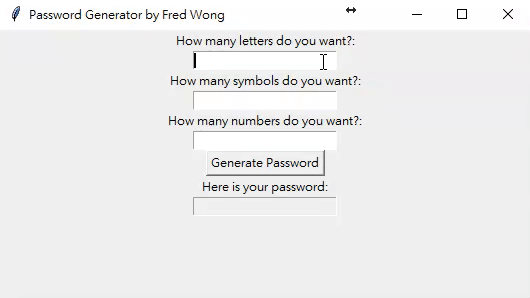

# Simple Password Generator

A very clear and Simple Password Generator which can generate password randomly by user criteria (input amounts of letters/number/symbols). 
## Demo

## Instruction
The main objective of this script is to generate a password dictionary by combining custom rules. The primary target audience is enterprises, aiming to assist security personnel in self-auditing "weak passwords that comply with the password policy."
## Password Criteria
You can select 3 Criteria below to generate your Password:

Letters : a-z & A-Z 

Numbers : 0 - 9

Symbols : !#$%&()*+ 

## How to Install & Use
Go to https://github.com/FredWong124/password_generator/blob/main/PWgenerator%20.exe

Down load raw file "PWgenerator.exe"

Run it.
